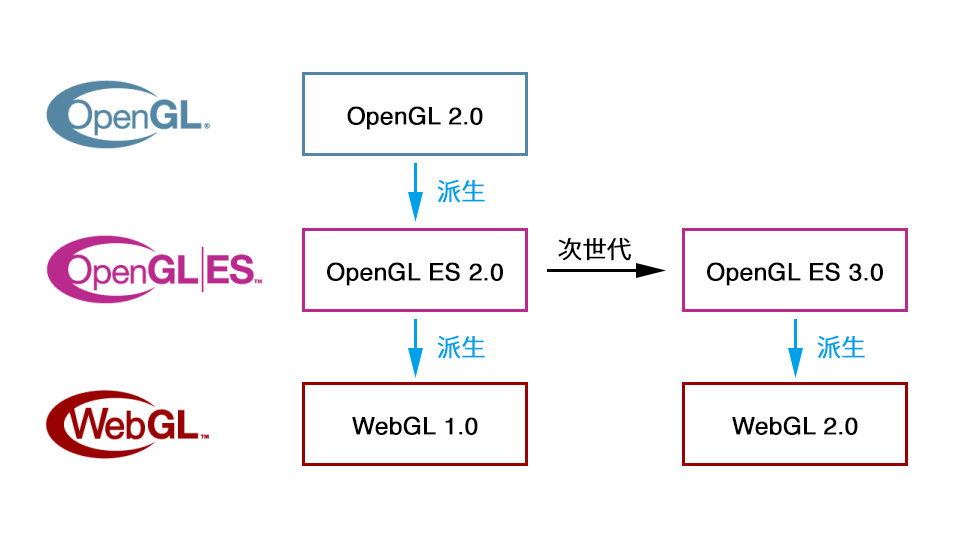

<!-- _class: title -->

# WebGL

2022/12 勉強会 田中

---

<!-- _class: center -->

# WebGL とは

---

## WebGL

- ウェブブラウザ上で[2D/3DCG](https://ics-creative.github.io/170706_webgl2_feature/geometry_instancing/src/) をレンダリングするための JavaScript API
- 2011 年に発表
- OpenGL/OpenGL ES がルーツとなっている
<!-- - ブラウザでCGを描画できるAPI
- プログラムは JS で記述する制御コードと、コンピューターの GPU で実行するシェーダーコード (GLSL) で構成される -->

---

## OpenGL（Open Graphics Library）

- 1992 年に発表された 2D/3DCG ライブラリ
- 主にデスクトップ PC やワークステーション向けのクロスプラットフォーム

---

## OpenGL ES（OpenGL for Embedded Systems）

- 2003 年に発表された OpenGL の派生版
- 携帯電話や家電などの組み込み機器に搭載する際、OpenGL の仕様が膨大になったせいで大変だったため、不要な機能をできるだけ削ぎ落としたよりコンパクトな規格

---

## OpenGL/OpenGL ES/WebGL

---

## WebGL

- プログラムは JS で記述する制御コードと、コンピューターの GPU で実行するシェーダーコード (GLSL) で構成される

- CG や GLSL などの専門知識が多いため、かなりの学習コストがある

---

<!-- _class: center -->

## WebGL をサポートしたライブラリが登場

---

## WebGL ライブラリ

- three.js
- babylon.js

---

## three.js

- 初版が 2010 年と最も古く、WebGL でのスタンダードなライブラリとされている
- 多くのサイトで導入されている（https://webdesignclip.com/tag/3d-webdesign/ )

---

## babylon.js

- マイクロソフト社が開発した Microsoft 純正ライブラリ
- TypeScript ベース
- WebGL だけでなく、WebXR への対応も進んでいる

---

## 今後の流れ

- WebGL（OpenGL/OpenGL ES） の掘り下げ
- three.js/babylon.js に触れる
