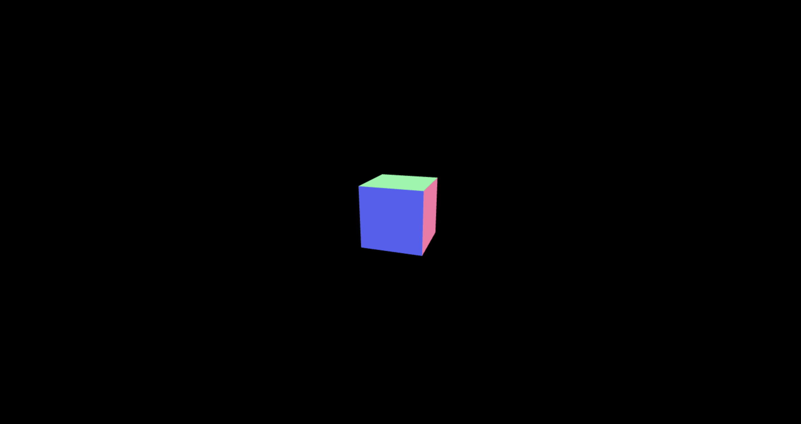

<!-- _class: title -->

# WebGL

2023/02 勉強会 田中

---

# これまで

- WebGL とは

  - ウェブブラウザ上で 2D/3DCG をレンダリングするための JavaScript API
  - OpenGL・OpenGL ES がベースになっている
  - WebGL をベースとした JavaScript ライブラリ（three.js/babylon.js 等）があり、多くの導入例がある

- three.js とは
  - 3D 描画に特化した JavaScript ライブラリ

---

<!-- _class: center -->

# three.js での 3DCG の実装

---

## three.js での実装に必要な要素

- カメラ
- シーン
- レンダラー
- オブジェクト

---

## サンプルコード

```ts
import * as THREE from "three";

let camera, scene, renderer, geometry, material, mesh;
const aspect = window.innerWidth / window.innerHeight;

// カメラ設定
camera = new THREE.PerspectiveCamera(70, aspect, 0.01, 10);
camera.position.z = 1;

// シーン設定
scene = new THREE.Scene();

// オブジェクト設定
geometry = new THREE.BoxGeometry(0.2, 0.2, 0.2);
material = new THREE.MeshNormalMaterial();
mesh = new THREE.Mesh(geometry, material);
mesh.rotation.x = 60;
mesh.rotation.y = 60;
scene.add(mesh);
```

---

## サンプルコード

```ts
// レンダラー設定
renderer = new THREE.WebGLRenderer({
  antialias: true,
  canvas: document.querySelector("canvas"),
});
renderer.setSize(window.innerWidth, window.innerHeight);
renderer.render(scene, camera);
```

```tsx
// 表示先
<canvas id="canvas"></canvas>
```

---

## サンプル実行結果



---

## カメラ

- 3D 空間での視点
- 投影方法
  - 透視投影（perspective）
  - 平行投影（orthographic）


<!-- - 以下を指定する必要がある
  - 画角
  - アスペクト比
  - 視界の最短距離
  - 視界の最長距離 -->

<!--  -->

---

## カメラ

```tsx
// カメラ設定（今回は透視投影）
camera = new THREE.PerspectiveCamera(
  70, // 画角
  aspect, // アスペクト比
  0.01, // 視界の最短距離
  10 // 視覚の最長距離
);
camera.position.z = 1;
```


---

## シーン

- 物体を配置する 3D 空間そのもの

```ts
// シーン設定
scene = new THREE.Scene();

// シーンにオブジェクトの追加
scene.add(object);
```

---

## レンダラー

- カメラに投影される 3D 空間を canvas に描画する機能

```ts
// レンダラー設定
renderer = new THREE.WebGLRenderer({
  antialias: true,
  canvas: document.querySelector("canvas"),
});
renderer.setSize(window.innerWidth, window.innerHeight);
renderer.render(scene, camera);
```

---

## オブジェクト（メッシュ）


- 描画対象となる物体
- メッシュは以下で構成される
  - 形（geometry）
  - 表面材質（materiak）

---

# react-three-fiber

- React で three.js を扱うためのラッパーライブラリ

---

## サンプルコード

```tsx
import { useRef } from "react";
import { Canvas } from "@react-three/fiber";
import { Mesh } from "three";

const Box = () => {
  const ref = useRef<Mesh>(null);

  return (
    <mesh ref={ref} rotation={[Math.PI / 3, Math.PI / 3, 0]}>
      <boxBufferGeometry args={[0.2, 0.2, 0.2]} />
      <meshLambertMaterial color={0x44c2b5} />
    </mesh>
  );
};

const Fiber = () => {
  return (
    <Canvas
      camera={{
        fov: 70,
        near: 0.01,
        far: 10,
        position: [0, 0, 1],
      }}
      style={{
        width: window.innerWidth,
        height: window.innerHeight,
      }}
    >
      <color attach="background" args={[0x000000]} />
      <ambientLight intensity={0.5} />
      <directionalLight intensity={0.5} position={[-10, 10, 10]} />
      <Box />
    </Canvas>
  );
};

export default Fiber;
```

---

## 今後の流れ

- WebGL1・WebGL2・WebGPU・WebXR をもう少し深ぼる
- 最終的には、実際に WebGL が導入されている web ページ（[日清のサイト](https://www.nissin.com/jp/)など）を模倣してみる
